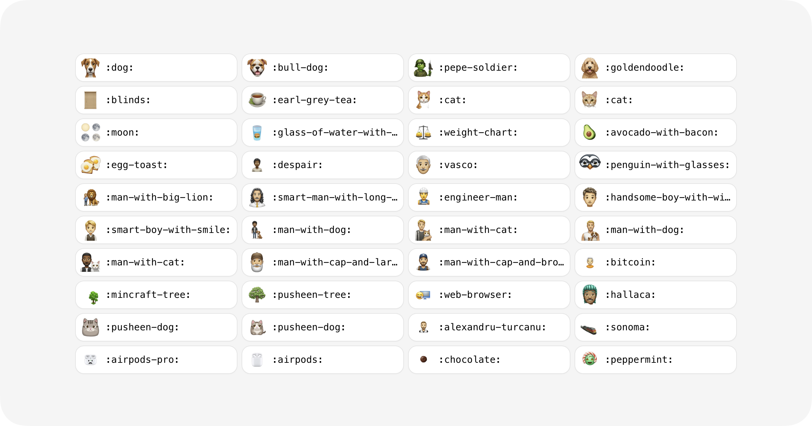

<a href="https://imagination.chat/">
  <h1 align="center">Imagination GPT</h1>
</a>

  Create web apps in seconds, using AI.

 # Example:

- A developer comes to a web page with a text input - let's say it's OpenBB's docs.

- The developer submits "I want an OpenBB app that lists top movers on the NASDAQ daily" into the text input.

- In the background, the "LLM-ify" package chains together LLMs, OpenBB's docs, and OpenBB's GitHub code to output the necessary library functions and code needed to build the NASDAQ app.

<!-- 

  

  

 -->

<!-- 

  <a href="#tech-stack"><strong>Tech Stack</strong></a> ·
  <a href="#tech-stack"><strong>Deploy Your Own</strong></a> ·
  <a href="#authors"><strong>Authors</strong></a> ·
  <a href="#credits"><strong>Credits</strong></a> ·
  <a href="#legal"><strong>Legal</strong></a>

 -->
<!-- 
 -->
 

## Tech Stack

- [Replicate](https://replicate.com/) - AI provider
- [Bun](https://bun.sh/) - Package Manager
- [PlanetScale](https://planetscale.com/) - MySQL database
- [Prisma](https://www.prisma.io/) - ORM
- [Next.js](https://nextjs.org/docs/app) - App Router, Server Actions
- [Vercel Blob](https://vercel.com/storage/blob) - Storage Bucket
- [Vercel KV](https://vercel.com/storage/kv) - Redis Database 
- [Vercel](https://vercel.com/) - Hosting

## Credits

- Alexandru Ţurcanu ([@pondorasti](https://x.com/pondorasti)) - for giving permission to modify this repo and use it for imagination-gpt
- Dylan Player ([@dylanplayer](https://twitter.com/dylanplayer)) - his contribution to the original Imaginations.sh repo
[@fofrAI](https://twitter.com/fofrAI)
- [prompt-classifier](https://replicate.com/fofr/prompt-classifier) - fine tuned llama-13b for determining toxicity by [@fofrAI](https://twitter.com/fofrAI)
- [rembg](https://replicate.com/cjwbw/rembg) - remove images background model by [@chenxwh](https://github.com/chenxwh)
- [Spirals](https://spirals.vercel.app/) - starter template and code examples by [@steventey](https://twitter.com/steventey)

## Legal

- [AGPL-3.0 License](https://github.com/[plowsai]/imaginationgpt/blob/main/LICENSE)
- [Terms & Conditions](https://imagination.chat/terms)
- [Privacy Policy](https://imagination.chat/privacy)